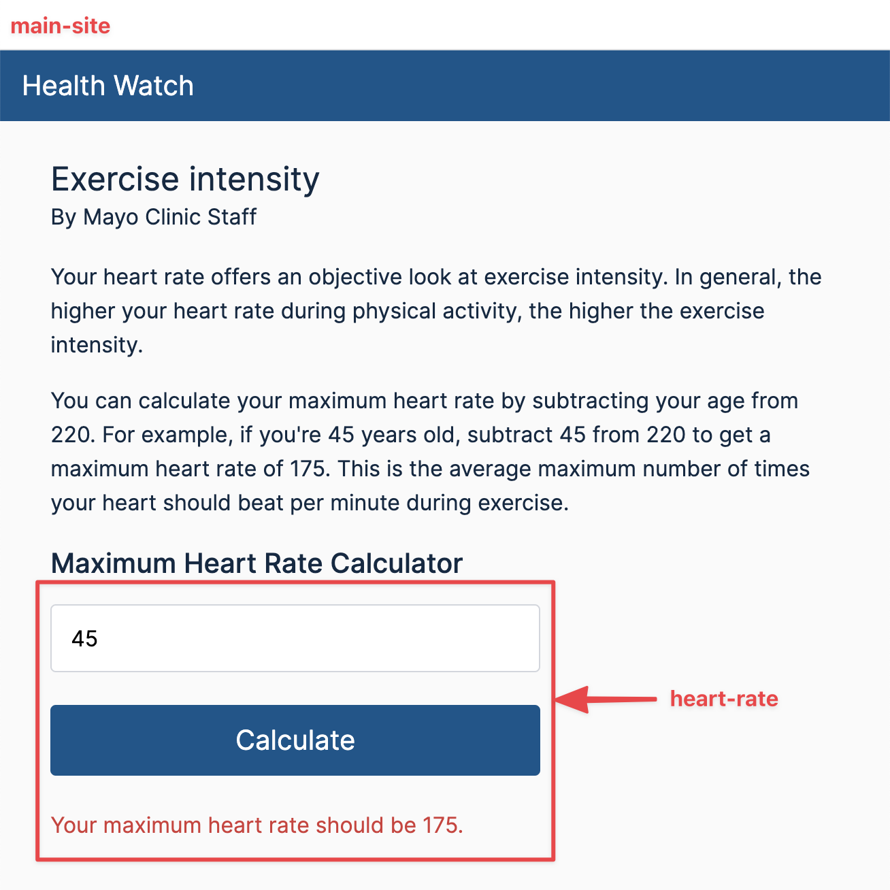

# React as Add-on

A simple demo to show how a React component can be added on to an existing
website. The basic idea comes from
[React docs](https://reactjs.org/docs/add-react-to-a-website.html), however the
example there is too simplistic. In this demo, I have created a full-fledged
React component using TypeScript and 3rd party libraries. Then I added this
component to a standalone website:

- `main-site` is the standalone website
- `heart-rate` contains a React component to compute the maximum heart rate
  given the age of a person



# Quick Start

```bash
cd heart-rate

# Install dependencies
yarn

# Make sure the component works in development mode
# Try at http://localhost:3000
yarn start

# Do a production build
# Output will be generated at /heart-rate/build
yarn build

# Copy the build/static folder to the main-site
cp -R build/static ../main-site

# Manual step
# Edit /main-site/index.html
#
# Change the last link tag in the head to contain the
# correct filename generated by the React build.
#   <link rel="stylesheet" href="/static/css/main.63e29462.chunk.css" />
#
# Change the last 3 script tags to contain the
# correct filenames generated by the React build.
# For example:
#   <script src="/static/js/runtime-main.03951e90.js"></script>
#   <script src="/static/js/2.a7221c96.chunk.js"></script>
#   <script src="/static/js/main.ca0b9158.chunk.js"></script>

# Run the main site using a simple HTTP server such as "serve"
# serve can be installed globally by running "npm install -g serve"
# Try out the main site at http://localhost:5000
cd ../main-site
serve
```
